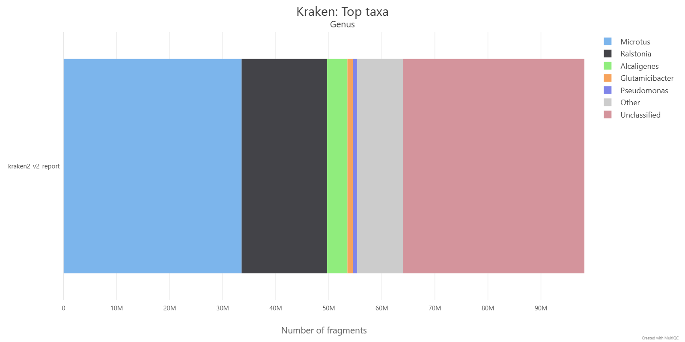
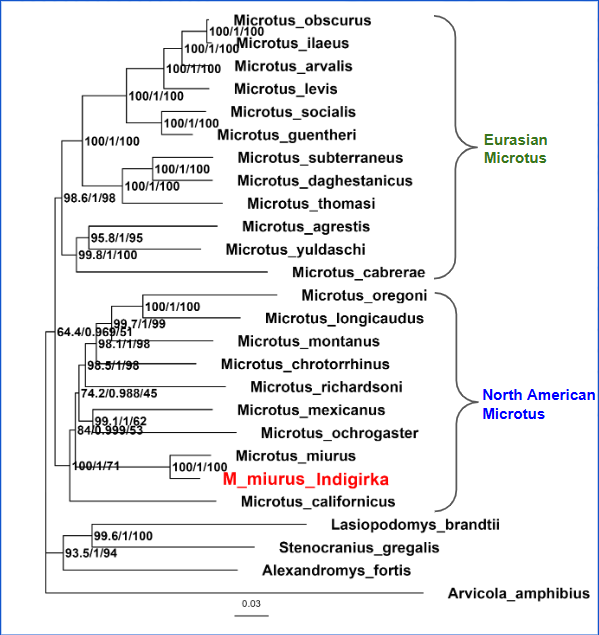
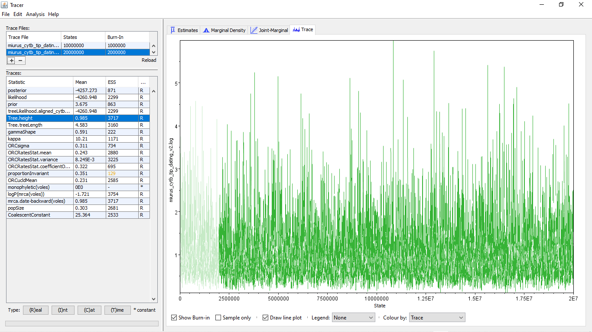
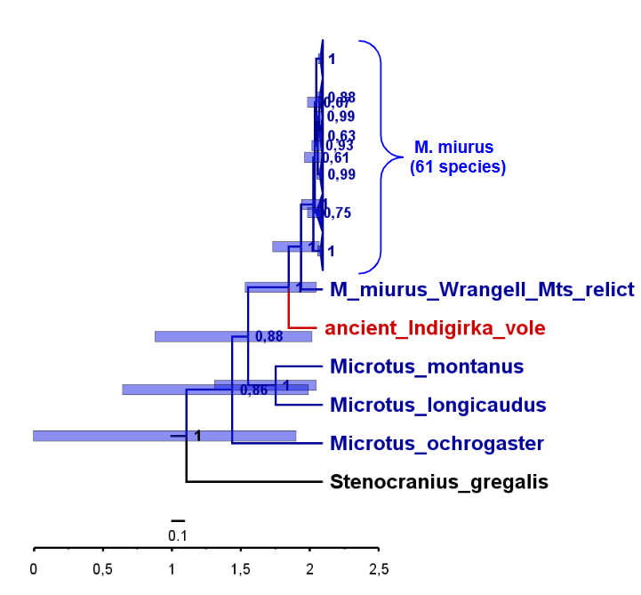

# Late_Pleistocene_vole_from_Indigirka_project

**Objective:** Reconstruct phylogeny and evolutionary history of *Microtus (Stenocranius) egorovi* (37,700 ± 2,200 BP, Indigirka River) using ancient DNA.

In the Late Pleistocene alluvial deposits of the upper Indigirka River (Eastern Yakutia), paleontologists discovered mummified vole specimens. Morphological analysis suggested similarity to the Nearctic singing vole *Microtus miurus*, currently distributed only in North America. This project uses NGS ancient DNA data to resolve its phylogenetic position.

---

## 📂 Project Structure

This repository contains the code, scripts, and minimal essential outputs. Large data files (raw FASTQ, BAM files, reference genomes, large intermediate files, Kraken2 database (223 GB)) are **not** stored in Git.

### 📦 Repository Structure (What's on GitHub)

```text
.
├── README.md                    # This file
├── environment.yml              # Conda dependencies
├── .gitignore                   # Exclusions for large files
│
├── scripts/                     # All pipeline scripts (executable)
│   ├── 01_preprocess_ancient_dna.sh
│   ├── 02_build_kraken_db.sh
│   ├── 03_map_and_damage.sh
│   ├── 04_ancient_mitogenome_assembly.sh
│   ├── 05_de_novo_mitogenome_assembly.sh
│   ├── 06_Microtus_mitogenome_phylogeny.sh
│   ├── 07_alternative_Microtus_mitogenome_phylogeny.sh
│   ├── 08_cytb_tip_dating.sh
│   ├── 09_cytb_ml_tree.sh
│   ├── rename_tree.py           # Utility: clean tree labels
│   ├── draw_tree.R              # Tree Visualization
│   └── kraken_build/
│       └── download_kraken.sh   # Helper: download genomes
│
├── figures/                     
│   ├── trees/
│   │   ├── cytb_dated_tree.jpg
│   │   └── mitogenome_tree.png
│   ├──beast2/
│   │   └── tracer_convergence.png      
│   └──kraken2/
│       └── kraken-top-n-plot.png
│   
└── results/             
    ├── trees/
    │   ├── mitogenome_tree_full.treefile     # Main ML tree
    │   ├── cytb_tree_ml_named.treefile       # Cytb ML tree
    │   ├── cytb_mcc_named.tree               # Dated BEAST2 tree (MCC)
    │   └── cytb_tip_dating.log               # Сontains the MCMC sampling statistics from the BEAST2 Bayesian dating analysis (open it in Tracer)
    └── reports/
        ├── multiqc_report.html               # Full QC report (interactive)
        └── mapdamage_results/                # KEY mapDamage outputs
            ├── Fragmisincorporation_plot.pdf  # ← C→T damage pattern
            ├── Length_plot.pdf                # ← Fragment length distribution
            ├── 5pCtoT_freq.txt                # C→T frequencies
            ├── 3pGtoA_freq.txt                # G→A frequencies
            ├── misincorporation.txt           # Overall stats
            ├── dnacomp.txt                    # DNA composition
            ├── lgdistribution.txt             # Length distribution
            ├── Stats_out_MCMC_post_pred.pdf   # MCMC posterior predictive check diagnostics (model fit validation)
            └── Runtime_log.txt                # Run log
               
```

### 🧬 Generated Results Structure (Created Locally)

_Note: These folders are created automatically when you run the scripts._

```text
results/
├── preprocessing/
│   ├── 01_fastp/               # Cleaned reads
│   └── 02_adapterremoval/      # Collapsed reads
├── kraken2_results/            # Classification reports
├── mapping/                    # BAM files, damage plots
├── damage/                       # Full mapDamage output (PDFs, R scripts)
├── mito_mapping/               # Consensus mitogenome assembly
├── mitoz_analysis/             # De novo assembled mitogenomes
└── phylogeny/
    ├── mitogenomes/            # IQ-TREE results (Full/Trimmed)
    └── cytb_analysis/          # ML trees and BEAST2 XMLs/logs
```

---

## 🚀 Quick Start (Usage)

1. **Clone the repository:**

```bash
git clone https://github.com/yourusername/Late_Pleistocene_vole_from_Indigirka_project.git
cd Late_Pleistocene_vole_from_Indigirka_project
```

2. **Make scripts executable (Run once):**

```bash
chmod +x scripts/*.sh
chmod +x scripts/kraken_build/download_kraken.sh
```

3. **Run the pipeline:** Scripts are numbered by execution order. Run them sequentially.

### Tree Visualization
**Reproduce the exact tree figure from the presentation**
Rscript scripts/plot_tree_presentation.R

---

## 🧩 Dependencies

### Option 1: Conda Environment (Recommended)

```bash
# Create environment
conda env create -f environment.yml

# Activate
conda activate late_pleistocene_vole_project
```

### Option 2: Manual Installation

All tools can be installed via [Bioconda](https://bioconda.github.io/):

```bash
conda install -c bioconda fastp adapterremoval kraken2 bwa samtools \
  bcftools picard mapdamage mitoz mafft iqtree clipkit beast2
```

### Python Dependencies

The `rename_tree.py` script uses only Python standard library — no additional packages required.

---

## 🔧 Pipeline Steps

### Step 1: Ancient DNA Preprocessing

**Script:** `scripts/01_preprocess_ancient_dna.sh`

- **Tools:** `fastp`, `AdapterRemoval`
- **Action:** Trims poly-G tails, removes adapters, merges overlapping reads (collapsing).
- **Input:** Raw FASTQ: 115,610,245 paired-end reads (Illumina).
- **Output:** Collapsed FASTQ (~98.2M reads). 

### Step 2: Kraken2 Database & Classification

**Script:** `scripts/02_build_kraken_db.sh`

- **Tools:** `kraken2`, `wget` (custom download script)
- **Action:** Builds a custom database containing NCBI taxonomy, Human genome, Bacteria, Viruses, Fungi, and _Microtus_ references.
- **Note:** Uses `scripts/kraken_build/download_kraken.sh` for reliable downloading of microbial genomes.
- **Output:** Kraken2 index (`kraken2_miurus/`) and classification report.

### Step 3: Mapping & Damage Assessment

**Script:** `scripts/03_map_and_damage.sh`

- **Tools:** `bwa aln`, `samtools`, `picard`, `mapDamage`
- **Action:** Maps reads to reference (optimized for aDNA: `-n 0.04`), marks duplicates, and assesses cytosine deamination patterns.
- **Output:** BAM file, mapDamage plots (confirms authenticity).

### Step 4: Ancient Mitogenome Assembly (Mapping-based)

**Script:** `scripts/04_ancient_mitogenome_assembly.sh`

- **Tools:** `bwa`, `bcftools`
- **Action:** Generates a consensus sequence from mapped reads.
- **Reference:** _M. abbreviatus_ mitogenome.
- **Output:** `consensus.fasta` (Ancient mitogenome), VCF file.

### Step 5: De Novo Mitogenome Assembly (Modern Relatives)

**Script:** `scripts/05_de_novo_mitogenome_assembly.sh`

- **Tools:** `fastq-dump`, `MitoZ` (with MEGAHIT assembler)
- **Action:** Assembles mitogenomes for modern _M. mexicanus_ and _M. oregoni_ from SRA data.
- **Output:** FASTA files for modern reference mitogenomes.

### Step 6: Phylogeny of Microtus Mitogenomes (Main Analysis)

**Script:** `scripts/06_Microtus_mitogenome_phylogeny.sh`

- **Tools:** `mafft`, `iqtree3`
- **Action:** Aligns full mitogenomes (Ancient + Modern + GenBank) and builds a Maximum Likelihood tree.
- **Model:** `GTR+F+I+R3` (selected by ModelFinder).
- **Output:** `mitogenome_tree_full.treefile` (Primary topology).

#### 📊 Data
- **Ingroup:** 25 *Microtus* mitogenomes (22 downloaded from GenBank + 3 newly assembled)
- **Outgroup:** *Arvicola amphibius* (MT381921)
- **Total taxa:** 26

### Step 7: Alternative Phylogeny (Trimmed Alignment)

**Script:** `scripts/07_alternative_Microtus_mitogenome_phylogeny.sh`

- **Tools:** `clipkit`, `iqtree3`
- **Action:** Re-runs phylogeny on a gappy-trimmed alignment to check robustness.
- **Output:** `mitogenome_tree_trimmed.treefile`.

### Step 8: Cytochrome b Tip-Dating (Bayesian)

**Script:** `scripts/08_cytb_tip_dating.sh`

- **Tools:** `BEAST2`, `TreeAnnotator`, `rename_tree.py`
- **Action:** Constructs a dated phylogeny using the ancient sample's age (37.7 kya) as a tip calibration.
- **Output:** `cytb_mcc.tree` (Dated tree with HPD intervals).
- **Workflow**: BEAST2 v2.7.7 → Tracer (ESS > 200) → TreeAnnotator → FigTree

#### 📊 Data
- **Gene**: Cytochrome b (cytb), ~1140 bp
- **Taxa**: 67 sequences (62 *M. miurus*, *M. abbreviatus*, outgroups: M. montanus, M. longicaudus, M. ochrogaster, Stenocranius gregalis + ancient Indigirka vole)
- **Ancient sample**: ancient Indigirka vole (37,700 ± 2,200 years BP)
- **Source**: NCBI GenBank (complete cyt b genes with voucher specimens)

### Step 9: Cytochrome b ML Tree (Validation)

**Script:** `scripts/09_cytb_ml_tree.sh`

- **Tools:** `iqtree3`
- **Action:** Builds a standard ML tree for Cytb without dating for topology validation.
- **Output:** `cytb_tree_ml.treefile`.

---

## 📊 Key Results Summary

### Adapter Trimming & Quality Control

- Collapsed FASTQ reads: 98.2M (~85% merge rate)
- Mean length: 128.5 bp (median: 114 bp)
- Quality: Q20 ≥99.78%, Q30 ≥99.12%
- GC content: 55.82%

### Kraken2 Database & Classification

**Database contents:**

- Taxonomy + Human genome
- Bacteria: ~9,000 reference genomes
- Viruses: ~15,041 genomes
- Fungi: ~664 genomes
- Microtus: 4 species

**Classification Results:**

| Category                  | Percentage | Reads     |
| ------------------------- | ---------- | --------- |
| **Classified**            | 65.18%     | 64.0M     |
| **Unclassified**          | 34.82%     | 34.2M     |
| **Microtus (endogenous)** | **34.19%** | **33.6M** |
| └─ To species level       | ~10%       | 10.1M     |
| └─ To genus only          | ~24%       | 23.4M     |
| Bacteria                  | ~29%       | 28.9M     |
| Human contamination       | 0.11%      | 0.1M      |
| Fungi                     | 0.61%      | 0.6M      |


**Kraken taxonomic classification using exact k-mer matches to find the lowest common ancestor (LCA) of a given sequence. Top taxa.**



📄 [multiqc_report.html](results/reports/multiqc_report.html)  
Comprehensive quality control summary including read length distributions, quality scores, adapter content, and taxonomic classification statistics from all preprocessing steps.

### Mapping & Damage Assessment

**Mapping Statistics:**

- Merged reads mapped: 8.68M (8.8% of collapsed)
- Unmerged properly paired: 6,324 (strict filtering)

**Damage Patterns:**

- 5' C→T substitutions: ~3.95% at position 1 (cytosine deamination)
- 3' G→A substitutions: Complementary pattern observed
- Typical aDNA damage profile confirmed

📁 [mapdamage_results/](results/reports/mapdamage_results/)  
Complete ancient DNA authentication data: cytosine deamination patterns (5' C→T and 3' G→A frequencies), fragment length distributions, misincorporation profiles, and MCMC posterior predictive checks confirming authentic aDNA damage signatures.

### Ancient Mitogenome Assembly

**Quality Control Results**

| Metric            | Value                      |
| ----------------- | -------------------------- |
| Mitogenome length | 16295 bp                   |
| Mean coverage     | 73.7×                      |
| Median coverage   | 64.0×                      |
| Covered bases     | 11,530 bp (71%)            |
| N content         | 47.85% (expected for aDNA) |

### De Novo Mitogenome Assembly (Modern Relatives)

| Species        | Length (bp) |
| -------------- | ----------- |
| _M. mexicanus_ | 16,307      |
| _M. oregoni_   | 16,294      |

### Phylogeny of Microtus Mitogenomes

**Best-fit model:** `GTR+F+I+R3` (selected by ModelFinder, BIC criterion)

| Metric     | Full Alignment          | Trimmed (ClipKIT)                   |
| ---------- | ----------------------- | ----------------------------------- |
| Length     | 22,907 bp               | 10,124 bp                           |
| Best Model | GTR+F+I+R3              | TIM2+F+R3                           |
| Topology   | Zoologically consistent | Slight rearrangements in deep nodes |

_Note: The trimmed alignment reduced matrix length from 22,907 bp to 10,124 bp. However, the untrimmed tree yielded a topology more consistent with established _Microtus_ systematics, so it is used as the primary result._

**Ancient Indigirka vole within Microtus mitogenome phylogeny**



**Conclusion:** The ancient specimen fits reliably into the singing vole clade Microtus miurus with maximum statistical support, which clearly confirms its species affiliation with American voles.

🌳 [mitogenome_tree_full.treefile](results/trees/mitogenome_tree_full.treefile)  
Maximum Likelihood tree based on complete mitogenomes (26 taxa, 22,907 bp, GTR+F+I+R3 model).

### Cytochrome b Phylogeny of *Microtus*

**Best-fit model**: `HKY+F+I+G4` (ModelFinder, BIC)

| Metric                                        | Value                                      |
| --------------------------------------------- | ------------------------------------------ |
| Root Age (_Microtus_)                         | 0.985 Myr [95% HPD: 0.102–1.446]           |
| Ancient Sample Placement                      | Basal sister lineage to modern *M. miurus* |
| Divergence (Ancient + Wrangel vs. Main Clade) | ~0.046–0.559 Myr [95% HPD]                 |
| MCMC Convergence                              | Stable (ESS > 200 for all key parameters)  |

**MCMC Convergence Check (Tracer)**



*All key parameters show ESS > 200, stable trace plots, and unimodal posterior distributions, confirming successful MCMC convergence.*


**Ancient Indigirka vole within Microtus miurus cytb phylogeny** 



**Conclusion:** The 37,700-year-old specimen represents a distinct late Pleistocene lineage sister to modern _M. miurus_, confirming genetic continuity across Beringia and the persistence of ancient haplogroups in isolated refugia (e.g., Wrangel Island).

🌳 [cytb_tree_ml_named.treefile](results/trees/cytb_tree_ml_named.treefile)  
Maximum Likelihood tree from cytochrome b alignment (67 taxa, ~1,140 bp, HKY+F+I+G4 model).

🕐 [cytb_mcc_named.tree](results/trees/cytb_mcc_named.tree)  
Time-calibrated Maximum Clade Credibility (MCC) tree from Bayesian tip-dating analysis. Node ages represent mean estimates with 95% HPD intervals; posterior probabilities indicate clade support.

📊 [cytb_tip_dating.log](results/trees/cytb_tip_dating.log)  
BEAST2 MCMC sampling statistics (20 million generations). Open in Tracer to verify ESS > 200 and inspect posterior distributions of divergence times, clock rates, and tree priors.

---

## 📁 Output Files Guide

Detailed list of key output files:

- **Preprocessing:** `results/preprocessing/02_adapterremoval/02_miurus.collapsed.fastq.gz`
- **Mapping:** `results/mapping/sep_bams/miurus_merged.bam`
- **Consensus:** `results/mito_mapping/03_consensus/consensus.fasta`
- **Trees:**
    - `results/phylogeny/mitogenomes/mitogenome_tree_full.treefile`
    - `results/phylogeny/cytb_analysis/cytb_mcc.tree`

---

**Authors:** Natalia Laskina, Liliya Revyakina  

**Year:** 2026